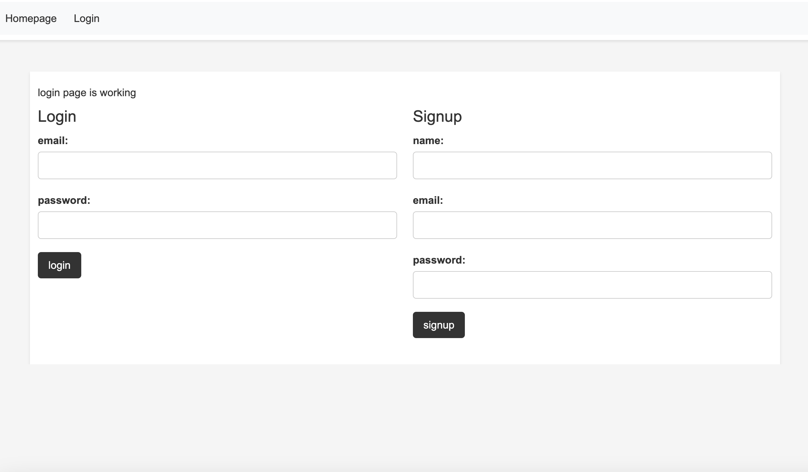

# <Tech-Blog-Fullstack-Website>

## Description

Provide a short description explaining the what, why, and how of your project. Use the following questions as a guide:

- I was motivated to build this out of my desire to have a blogging site that was simple and easy to use
- I built this to learn how use Handlebars and write API routes
- This app is one step towards solving the problem of reddit turning into garbage. Maybe something like this will take its place some day and this is my first step towards bringing that into the world
- From building this I learned many things. The most important of which is probably that MySQL Workbench doesn't like to work with Macs a lot of the time. I also learned about handlebars and Sequelize.


## Installation

There's nothing to install. Just follow this link

https://tech-blog-fullstack-website-e1ee7a9a2a02.herokuapp.com/login


## Usage

Provide instructions and examples for use. Include screenshots as needed.

To add a screenshot, create an `assets/images` folder in your repository and upload your screenshot to it. Then, using the relative filepath, add it to your README using the following syntax:

    ```md

    ```

## Credits

Developer- Everitt Gill

Github- https://github.com/EverittGill

Tutorials followed- GA Tech fullstack development bootcamp resources and classes

## License

MIT license

## Features

Standard blog features. Logging in, creating articles, adding comments

